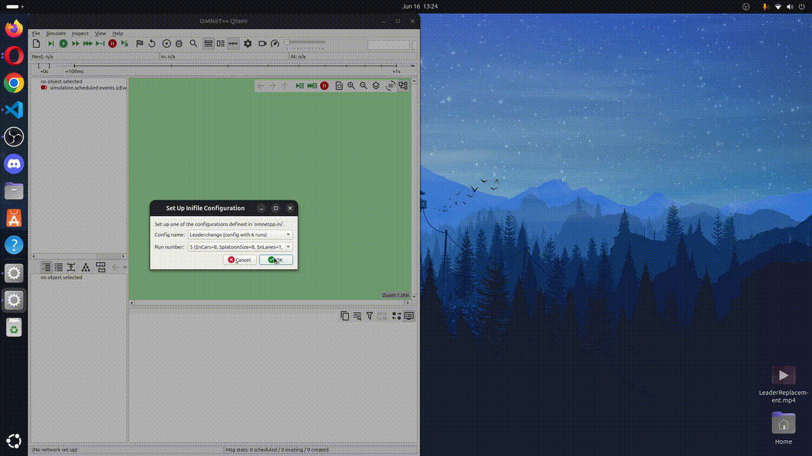

# LeaderReplacement - PLEXE

LeaderReplacement is a protocol, built on top of [PLEXE](https://plexe.car2x.org), that addresses the challenge of maintaining formation stability when the current platoon leader must exit.
Our approach transforms this challenge into a structured communication protocol that automatically promotes the second vehicle to leadership while preserving platoon cohesion.

## 🛠️ How to run

To test and use the leader replacement protocol, it is first necessary to install the required tools: [SUMO](https://sumo.dlr.de/docs/index.html) and [OMNeT++](https://omnetpp.org/). The installation procedures and any additional setup steps are clearly described in the official documentation of each tool.

Once the basic simulation environment is in place, the next step is to obtain the [Veins framework](https://veins.car2x.org/), which can be downloaded from its GitHub repository. It is advisable to clone the project into the `~/src/` directory (or any other consistent location) to simplify later steps. Installation instructions for Veins are available on its official website.

You can now download this repository, containing the leader replacement protocol. This repository should be cloned into the same directory as Veins. The installation steps are analogous to those of the original [PLEXE](https://plexe.car2x.org/) project and can be followed accordingly.

After cloning and building both projects, they must be imported into the same OMNeT++ workspace. This can be done via the interface using `File > Import > Existing Projects into Workspace`, selecting both Veins and the protocol repository.

To execute the simulation, locate the `omnetpp.ini` file found under the PLEXE project folder at `plexe/examples/platooning`, open it within OMNeT++, and run the simulation. When prompted, select the `Leaderchange` configuration and choose the desired run to simulate.

## 👥 Contributions

This protocol was depeloved as part of the Vehicular Networks & Cooperative Driving Course, at the [Università degli Studi di Brescia](https://www.unibs.it/), by the following students assisted by the [ANS (Advanced Networking Systems)](https://ans.unibs.it) researchers.

**Students:**

- Lizza Marco
- Moro Andrea
- Pluda Michael
- Rocchello Alessandro

**Professors**

- Lo Cigno Renato
- Ghiro Lorenzo
